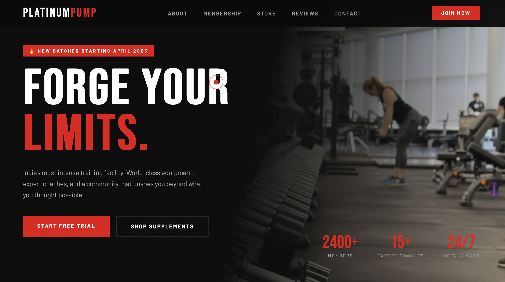

# 🏋️ PlatinumPump Gym Website

A fully responsive gym website with an integrated supplement store,
membership plans, and contact form. Built from scratch using 
HTML, CSS, and JavaScript.

## 🔗 Live Demo
[View Website](https://abhi02605.github.io/gym-website)

## 📸 Preview


## ✨ Features
- Hero section with animated stats
- Membership plans with pricing
- Supplement store with category filters
- Add to cart functionality
- Contact form
- Mobile responsive design
- Smooth scroll animations
- Custom cursor

## 🛠️ Built With
- HTML5
- CSS3 (animations, flexbox, grid)
- Vanilla JavaScript
- Google Fonts

## 🚀 How to Run
```bash
git clone https://github.com/abhi02605/gym-website.git
cd gym-website
open index.html
```

## 📁 Project Structure
```
gym-website/
├── index.html      ← entire website
└── README.md       ← this file
```

## 🎯 What I Learned
- CSS animations and keyframes
- JavaScript DOM manipulation
- Responsive layouts with CSS Grid
- Building interactive UI components
- Git and GitHub workflow

## 👤 Author
Abhishek Baghel — BTech ECE 1st Year
GitHub: @Abhi02605
```

---


